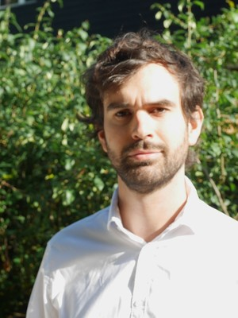
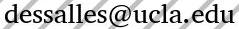
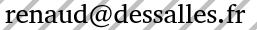

## Presentation

I'm finishing my postdoc (visiting researcher) at the laboratory of [Biomathematics of UCLA](http://biomath.ucla.edu/). I've werked there on the modeling of the immune responses to antigens. My main interested consist in mathematical and computational modeling applied to biology, using stochastic and determnistic models. During my PhD in applied mathematics at INRA and INRIA (France), I worked on the stochastic modeling of protein production inside bacteria. My main skills consist of the analysis of stochastic and deterministic models and the use of several computational language (Python, C++, Matlab, Julia) for simulations.

- My [Resume in English](./CV_Dessalles_Renaud_en.pdf).
- Mon [Curriculum Vitae en Français](./CV_Dessalles_Renaud_fr.pdf).

## Ongoing collaborations and projects

- With [T. Chou (UCLA – Biomathematics)](https://tchou.faculty.biomath.ucla.edu/) and [M.  D’Orsogna (CSUN – Math Department)](http://www.csun.edu/~dorsogna/): Stochastic models for T-cell diversity.
- With [A. Sadier (UCLA – Sears lab)](https://searslab.eeb.ucla.edu/members/): Reaction diffusion models in the teeth development in bats.
- With [Julie Miller (UCLA – Pinter-Wollman Lab)](https://pinterwollmanlab.eeb.ucla.edu/people/) Statistic model for ant foraging.

## Publications

* Dessalles, R., D’Orsogna, M., and Chou, T. (2018). Exact Steady-State Distributions of Multispecies Birth–Death–Immigration Processes: Effects of Mutations and Carrying Capacity on Diversity. J Stat Phys. [Journal's page
📰](https://link.springer.com/article/10.1007/s10955-018-2128-4), [Arχiv's version](https://arxiv.org/abs/1806.00105).
* Dessalles, R., Fromion, V., & Robert, P. (2019). Models of protein production with cell cycle. arXiv preprint arXiv:1711.06378. [Arχiv's version](https://arxiv.org/abs/1711.06378) (under review)
* Cloez, B., Dessalles, R., Genadot, A., Malrieu, F., Marguet, A., & Yvinec, R. (2017). Probabilistic and Piecewise Deterministic models in Biology. ESAIM: Proceedings and Surveys, 60, 225-245. [Journal's page 📰](https://www.esaim-proc.org/articles/proc/abs/2017/05/proc186012/proc186012.html), [Arχiv's version](https://arxiv.org/abs/1706.09163)
* Dessalles, R. (2017). Stochastic models for protein production: the impact of autoregulation, cell cycle and protein production interactions on gene expression (Doctoral dissertation, École Polytechnique). [Hal's version](https://tel.archives-ouvertes.fr/tel-01482087/)
* Dessalles, R., Fromion, V., & Robert, P. (2017). A stochastic analysis of autoregulation of gene expression. Journal of mathematical biology, 75(5), 1253-1283. [Journal's page 📰](https://link.springer.com/article/10.1007/s00285-017-1116-7), [Arχiv's version](https://arxiv.org/abs/1509.02045)

## Selected Presentations
Relative to the article *A stochastic analysis of autoregulation of gene expression.*
* INFORMS Applied Probability Conference (July 2015)
* Les probabilités de demain (May 2016) (<http://www.lesprobabilitesdedemain.fr/>): [Video 🎥](https://www.youtube.com/watch?v=gbVSSXbVCZw&t)

Relative to the article *Probabilistic and Piecewise Deterministic models in Biology.*
* Journées Modélisation Aléatoire et Statistique (August 2016) (<http://mas2016.sciencesconf.org/>)

Relative to the article *Models of protein production with cell cycle.*
* UCLA Biomathematics Seminar (October 2017)

Relative to the article *Exact Steady-State Distributions of Multispecies Birth–Death–Immigration Processes*
* APS March Meeting (March 2018) (<https://meetings.aps.org/Meeting/MAR18/Session/P49.10>)

## Teaching
* Certificat informatique et internet (Computer and Internet Certificate – C2I) at IUT-Sceaux (France) [course's page](https://team.inria.fr/rap/members/dessalles/enseignement-iut/)
* Teaching Assistant of Mathematics Discussion Section at at IUT-Sceaux (France)
* [UCLA's Collaboratory](https://qcb.ucla.edu/collaboratory/)'s Python Intorduction Workshop: [workshop's page](https://github.com/QCB-Collaboratory/W9.Python)
* [UCLA's Collaboratory](https://qcb.ucla.edu/collaboratory/)'s Machine Learning with Python Workshop:
	* [Workshop's page](https://github.com/QCB-Collaboratory/W17.MachineLearning)
	* Slides: [Day 1](https://drive.google.com/file/d/12FTwaXU8m_H6SXbeY2gmq0WLVceaXtOJ/view?usp=sharing), [Day 2](https://drive.google.com/file/d/1qKNwowukfbEU-EPk6iizUqnIobbJv8Vy/view?usp=sharing), [Day 3](https://drive.google.com/file/d/1o3_pmaoWtyQE_cxZ-qj4hmRfmGTovNZA/view?usp=sharing)
	* Videos 🎥: [Day 1](https://www.youtube.com/watch?v=7Iy1BylhlSE), [Day 2](https://www.youtube.com/watch?v=6bxlABMc-10), [Day 3](https://www.youtube.com/watch?v=NSXwh5BFIls)
* [UCLA's Collaboratory](https://qcb.ucla.edu/collaboratory/)'s Python Hackathon: [hakathon's page](https://github.com/QCB-Collaboratory/Python-Hackathon-Fall2017/tree/master/Materials_Resources)

## Programming

Under the Github account [Grumpfou](https://github.com/grumpfou/) I have created two main softwares:
* **RFigure**: software created to as tool for my professional work. **RFigure** that allows to
store data and instructions that allow the production of Matplotlib
instructions. Sources and download are available on Github: [source
code](https://github.com/grumpfou/RFigure). See also [this blog post]()

* **AthenaWriter**: an open source softwares such as [AthenaWriter](https://github.com/grumpfou/AthenaWriter), a short stories word processor.

## Also…

During my spare time, I'm an editor of the online Magazine [Kinea](http://kinea.media): a plurilingual magazine proposing rigorous political and economical an

## Contact

Either  or 
