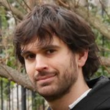

## Presentation

I'm PhD researcher at [MaIAGE](http://maiage.jouy.inra.fr/) (INRA — Jouy-en-Josas — France) and currently a visiting researcher at the laboratory of [Biomathematics of UCLA](http://biomath.ucla.edu/). I'm currently working on the modeling of the immune responses to antigens. My main interested consist in mathematical and computational modeling applied to biology, using mainly (but not exclusively) stochastic models. During my PhD in applied mathematics at INRA and INRIA (France), I worked on the stochastic modeling of protein production inside bacteria. My main skills consist of the analysis of stochastic and deterministic models and the use of several computational language (Python, C++, Matlab, Julia) for simulations.

Look at my [Resume](./CV_Dessalles.pdf).

## Publications
* Dessalles, R., Fromion, V., & Robert, P. (2017). A stochastic analysis of autoregulation of gene expression. Journal of mathematical biology, 75(5), 1253-1283. [Journal's page](https://link.springer.com/article/10.1007/s00285-017-1116-7), [ArXiv's version](https://arxiv.org/abs/1509.02045)
* Dessalles, R. (2017). Stochastic models for protein production: the impact of autoregulation, cell cycle and protein production interactions on gene expression (Doctoral dissertation, École Polytechnique). [Hal's version](https://tel.archives-ouvertes.fr/tel-01482087/)
* Cloez, B., Dessalles, R., Genadot, A., Malrieu, F., Marguet, A., & Yvinec, R. (2017). Probabilistic and Piecewise Deterministic models in Biology. ESAIM: Proceedings and Surveys, 60, 225-245. [Journal's page](https://www.esaim-proc.org/articles/proc/abs/2017/05/proc186012/proc186012.html), [ArXiv's version](https://arxiv.org/abs/1706.09163)
* Dessalles, R., Fromion, V., & Robert, P. (2018). Models of protein production with cell cycle. arXiv preprint arXiv:1711.06378. [ArXiv's version](https://arxiv.org/abs/1711.06378)

## Selected Presentations
Relative to the article *A stochastic analysis of autoregulation of gene expression.*
* INFORMS Applied Probability Conference (July 2015)
* Les probabilités de demain (May 2016) (<http://www.lesprobabilitesdedemain.fr/>): [Video](https://www.youtube.com/watch?v=gbVSSXbVCZw&t)

Relative to the article *Probabilistic and Piecewise Deterministic models in Biology.*
* Journées Modélisation Aléatoire et Statistique (August 2016) (<http://mas2016.sciencesconf.org/>)

Relative to the article *Models of protein production with cell cycle.*
* UCLA Biomathematics Seminar (October 2017)

## Teaching
* Certificat informatique et internet (Computer and Internet Certificate – C2I) at IUT-Sceaux (France) [course's page](https://team.inria.fr/rap/members/dessalles/enseignement-iut/)
* Teaching Assistant of Mathematics Discussion Section at at IUT-Sceaux (France)
* [UCLA's Collaboratory](https://qcb.ucla.edu/collaboratory/people/)'s Python Intorduction Workshop: [workshop's page](https://github.com/QCB-Collaboratory/W9.Python)
* [UCLA's Collaboratory](https://qcb.ucla.edu/collaboratory/people/)'s Python Hackathon: [hakathon's page](https://github.com/QCB-Collaboratory/Python-Hackathon-Fall2017/tree/master/Materials_Resources)

## Also…

During my spare time, I'm an editor of the online Magazine [Kinea](http://kinea.media): a plurilingual magazine showing proposing rigorous political and economical analyses but also natural, social and human science popularization.

I also program open source softwares such as [AthenaWriter](https://github.com/grumpfou/AthenaWriter), a short stories word processor.
